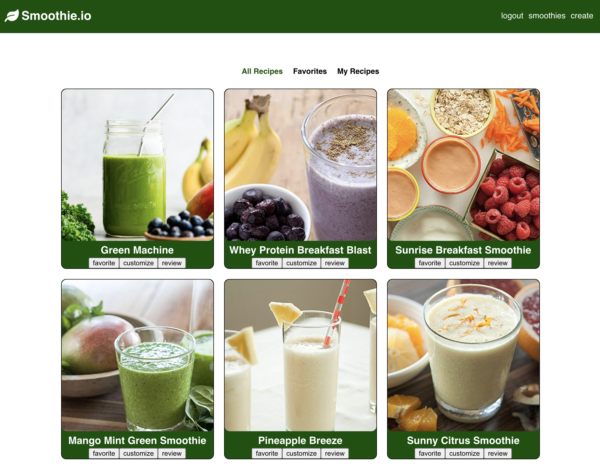
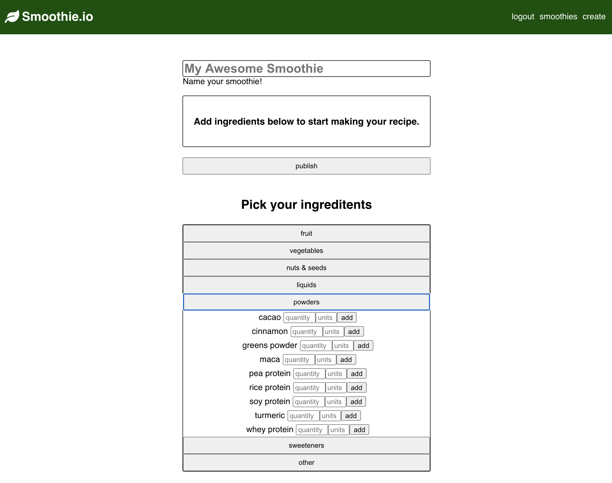
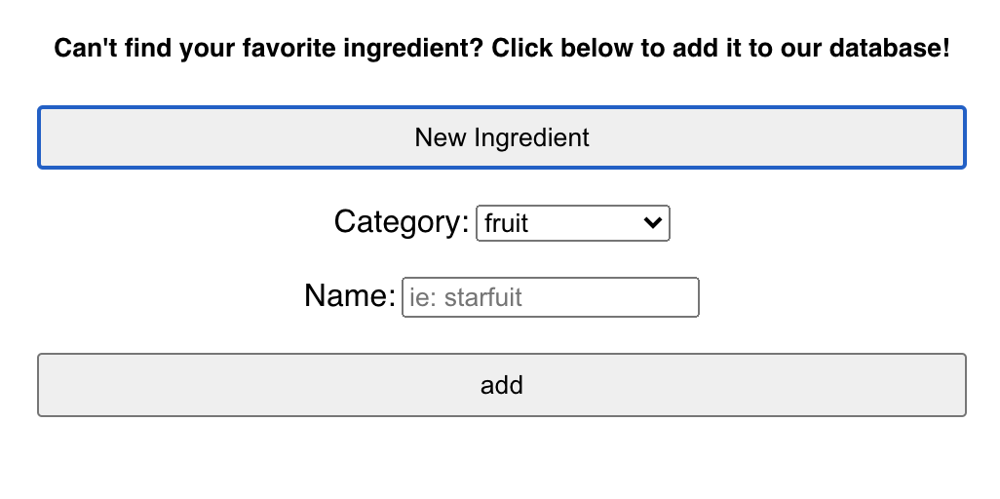
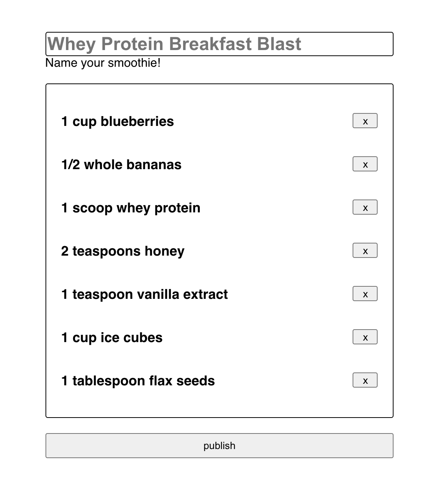

# Smoothie.io

**Live:** https://brendanreape88.github.io/smoothie.io/

## Description:

Smoothie.io helps you find amazing smoothie recipes, and also lets you customize them or create them from scratch. Once you’ve perfected your recipe, publish it to share it with the world!

## Login Credentials:

Username: greenguru 
Password: Greenguru1!

## Browsing Recipes:

Once logged in, head to the ‘/home’ path to see a list of all the existing smoothies in the database. The navigation links above the recipes allow you to filter the list of displayed recipes by your favorites, as well as the recipes you’ve published. To add or remove a smoothie to your favorites list, simply click the “favorite” button on the recipe.

## Creating A Recipe:

To create a recipe, head to the ‘/create’ path and check out the accordion menu of ingredients. Click on a category to see the full list of ingredients. Once you find what you’re looking for, enter the amount of the item you want, as well as the units of measurement (ie: cup, spoonful, oz., whole, bunch, etc.) then click “add.” You’ll see your newly added ingredient in the box above. Keep adding ingredients until you’ve constructed the perfect recipe, then give it a great name, and click “publish” to add it to the Smoothie.io database.

## Add An Ingredient To The Database:

To add an ingredient to the database, look directly below the accordion menu and click “add new ingredient.” This will open a form where you can specify the category of the ingredient along with its name. Click “add” to send it to the database.

## Customize A Smoothie:

To customize an existing recipe, simply find the recipe you wish to work with, then click “customize.” You’ll once again be taken to the ‘/create’ path, but this time all of the fields will be pre-populated for you. Simply remove the ingredients you don’t want by clicking the “x” button next to them, then head back to the accordion menu to add any additional ingredients you want.

## Technology Used:

**HTML5, CSS3, JavaScript, React, Node.js, Express, Postgres**
